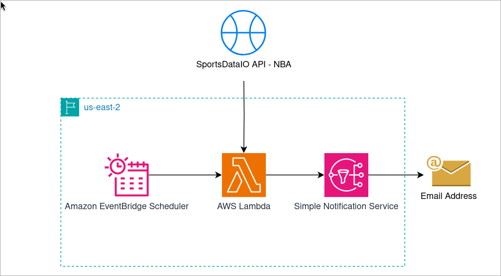

# Game Data Collector
## Overview:
The Intent of this project is to automate the retrival and delivery of NBA game data using the NBA SportsDataIO API [1]. This is accomplished through utilizing Amazon EventBridge Scheduler [2] to invoke an AWS Lambda [3] function every 2 hours. The Lambda function pulls the requested data, formats it and publishes it to an SNS topic [4]. The subscription type is configured to send an email.

### AWS Architecture:

**Services Used**:
1) Amazon EventBridge Scheduler
2) AWS Lambda
3) Amazon SNS

### Future Enhancements:
1) Add API Gateway for a web application to request sports data outside of the scheduled invocations.
2) Add DynamoDB to store the results in a table for querying at a later point in time.
3) Setup CI/CD pipeline for iteration on the solution.

### Prerequisites:
1) AWS Account to deploy resources
2) NBA SportsDataIO API key
3) Terraform
  
### Steps to deploy this in your account:
1) Clone the Directory to your local environment.
2) Configure AWS CLI and/or export AWS access keys as variables.
3) Change directory into `./Terraform`.
4) Initialize Terraform with `terraform init`
5) Deploy the resources with Terraform `terraform apply`
  - You will need to input email address for the SNS topic, and the SportsDataIO API key when applying/destroying the resources through Terraform. 

**NOTE** You can delete all resources with `terraform destroy`.
**NOTE** You cannot unsubscribe to a subscription that is pending confirmation. If you use `email`, `email-json`, or `http/https` (without auto-confirmation enabled), until the subscription is confirmed (e.g., outside of Terraform), AWS does not allow Terraform to delete / unsubscribe the subscription. If you destroy an unconfirmed subscription, Terraform will remove the subscription from its state but the subscription will still exist in AWS.
 - The subscription that is pending confirmation will be automatically deleted by AWS after 48 hours [5].

## References:
1) [SportsDataIO API](https://sportsdata.io/developers/api-documentation/nba)
2) [Amazon EventBridge Scheduler](https://docs.aws.amazon.com/eventbridge/latest/userguide/using-eventbridge-scheduler.html)
3) [AWS Lambda](https://docs.aws.amazon.com/lambda/latest/dg/welcome.html)
4) [Amazon SNS](https://docs.aws.amazon.com/sns/latest/dg/welcome.html)
5) [Amazon SNS supports automatic deletion of unconfirmed subscriptions](https://aws.amazon.com/about-aws/whats-new/2023/05/amazon-sns-automatic-deletion-unconfirmed-subscriptions/)
6) [Youtube Video](https://www.youtube.com/watch?v=09WfkKc0x_Q&t=1430s)
- REXTECH friends

